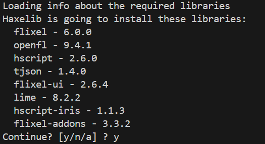

# How to Build?

This page still in working, both for engine

1. Install Haxe 4.3.6, Git latest version
2. Install Haxelib for the `Project.xml`
    - Go to the root project and open the terminal, type `haxelib install haxelib.hxml`
    - If the terminal show like this: , type `y` to continue install